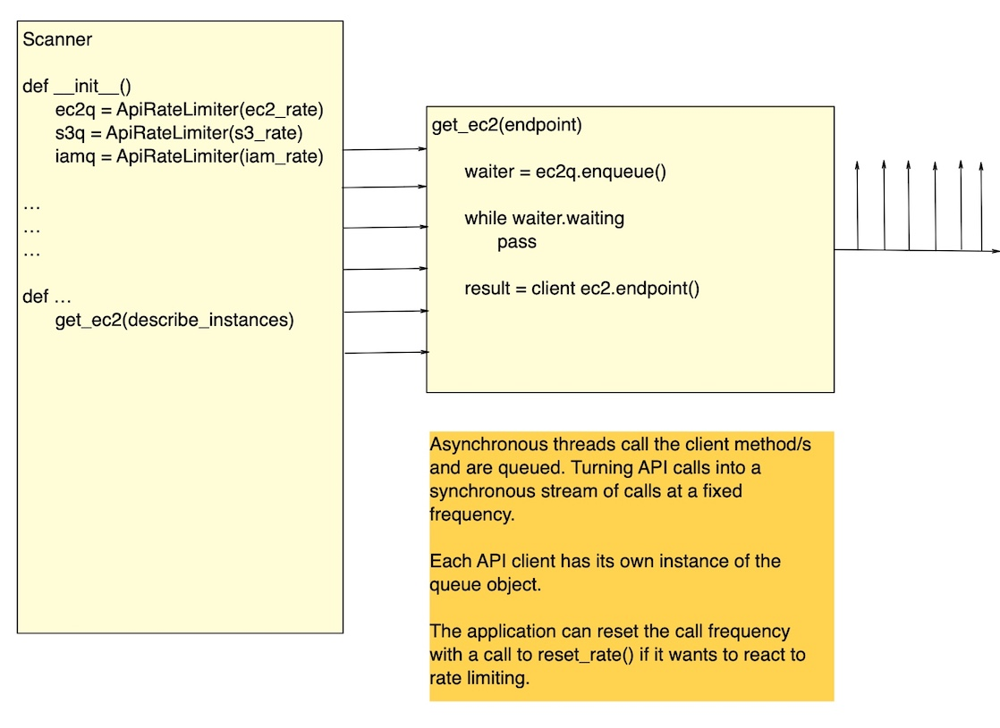

# API Rate Limiter
> A simple class that allows you to implement client side API rate 
limiting.

---

## Introduction

This project was created to address a specific issue – API rate limiting
 when scanning an AWS platform.

The problem with AWS applying rate limiting to the services is that it 
is indiscriminate in nature. So if you are running a multi-threaded 
scanner such as ScoutSuite, while for example an Auto Scaling Group is 
trying to scale something, the auto Scaling can fail because AWS does 
not distinguish between the third party scanner and its own services.

This is a cause for frustration amongst the platform support team and 
can also cause an outage, particularly in the early stages of 
development of a new service, where resilience and high availability are
still but a twinkle in the architect's eye...

This is becoming more and more of an issue as consumers realise the 
necessity of scanning their cloud platforms.

## NOTE!

Apologies for the lack of images if you are viewing this on PyPi. For 
some reason PyPi insist on changing the URLs to 
https://warehouse-test-camo.cmh1.psfhosted.org/..... I've no idea why.
You can read this README correctly on the home project on GitHub.

## History

I started looking into this issue when scanning my own client's platform
 and hit this when scanning some 15k of snapshots.
 
Initially I managed to mitigate this using the Network Link Conditioner 
on the MAC I was using to run the scanner. 

The NLC allows you to add latency to all outbound packets on a given 
network like so:


This blanket approach to delaying all outbound packets did resolve the 
issue of the rate limiting, but at a cost of causing the scanner to now
run for two hours in order to complete a scan of all of our development 
environments.

Not only was this slow, but it's also not OS agnostic, so hardly a good 
solution.

It occurred to me that if a mechanism could be created within boto3 
itself to queue outbound API calls at a configurable rate, then this 
might might prove to be a more general solution to the issue.



So I forked botocore [here](https://github.com/museadmin/botorate) into 
a project that combined forks of botocore, boto3 and ScoutSuite.

This project has the queue implemented in it and boto3 has been 
refactored to pass through the value of the API rate in ms to botocore. 
ScoutSuite is included and has simply been hardcoded to apply the queue 
to ec2 clients.

This has enabled me to conduct comparative runs between this solution 
and using the Network Link Conditioner. With the former completing in 30
 minutes and the latter in around 2 hours.
 
The queue was only applied to ec2 clients because I was only 
experiencing rate limiting on the scanning of the snapshots, around 15k 
+

At the time of writing botocore seem to be unwilling to accept the PR 
for this as they feel that it is beyond the scope of their project. 

c'est la vie.

Rather than cry over a missed opportunity I've now taken the rate 
limiter and packaged it up as a stand alone utility that anyone can 
consume in their own projects should they need to avoid server-side rate 
limiting in their own applications.   

## Installation

OS X & Linux:

```sh
npm install my-crazy-module --save
```

Windows:

```sh
edit autoexec.bat
```

## Usage example

A few motivating and useful examples of how your product can be used. 
Spice this up with code blocks and potentially more screenshots.

_For more examples and usage, please refer to the [Wiki][wiki]._

## Development setup

Describe how to install all development dependencies and how to run an 
automated test-suite of some kind. Potentially do this for multiple 
platforms.

```sh
make install
npm test
```

## Release History

* 0.1.0
    * CHANGE: Update README (module code remains unchanged)
    * ADD LICENCE
    * ADD Graphics for README
    * FIX typo

## Meta

Bradley Atkins – bradley.atkinz @ gmail.com

Distributed under the MIT license. See ``LICENSE`` for more information.

[This Project on GitHub](https://github.com/museadmin/api-rate-limiter)

## Contributing

1. Fork it (<https://github.com/museadmin/api-rate-limiter>)
2. Create your feature branch (`git checkout -b feature/fooBar`)
3. Commit your changes (`git commit -am 'Add some fooBar'`)
4. Push to the branch (`git push origin feature/fooBar`)
5. Create a new Pull Request
