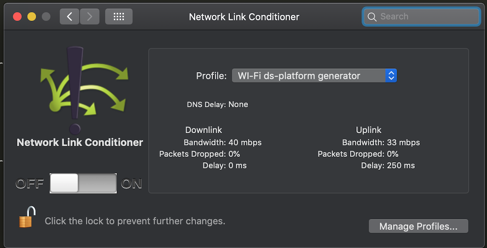
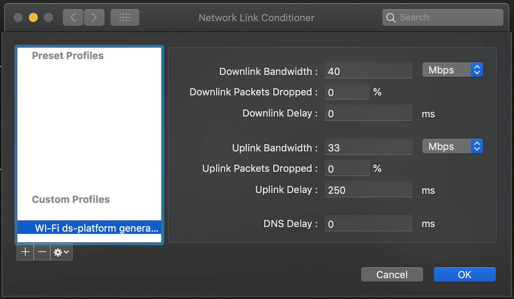
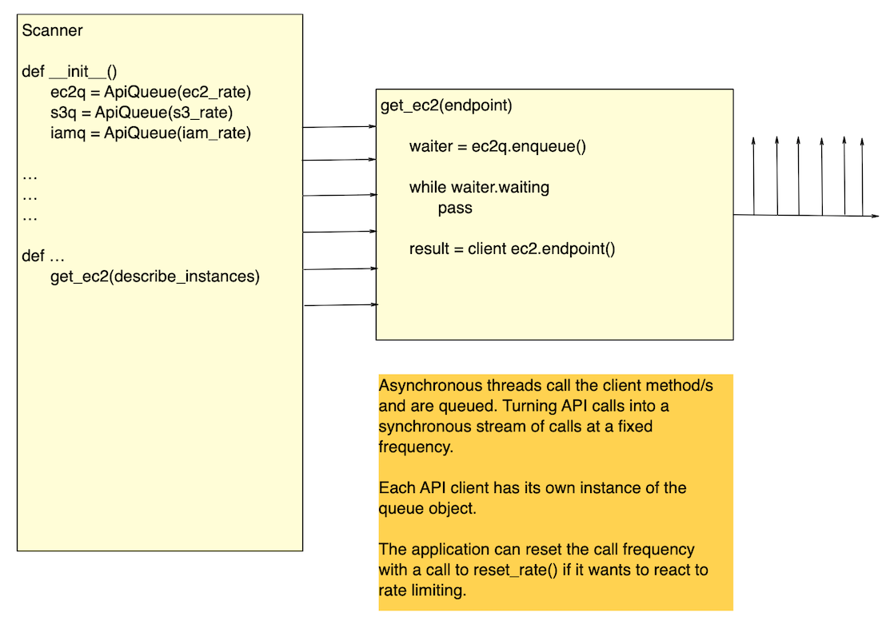

# API Rate Limiter

A simple Python object that allows you to implement client side API 
rate limiting.

---

## Introduction

This project was created to address a specific issue – API rate limiting
 when scanning an AWS platform.

The problem with AWS applying rate limiting to the services is that it 
is indiscriminate in nature. So if you are running a multi-threaded 
scanner such as ScoutSuite, while for example an Auto Scaling Group is 
trying to scale something, the auto Scaling can fail because AWS does 
not distinguish between the third party scanner and its own services.

This is a cause for frustration amongst the platform support team and 
can also cause an outage, particularly in the early stages of 
development of a new service, where resilience and high availability are
still but a twinkle in the architect's eye...

This is becoming more and more of an issue as consumers realise the 
necessity of scanning their cloud platforms.

## NOTE!

Apologies for the lack of images if you are viewing this on PyPi. For 
some reason PyPi insist on changing the URLs to 
https://warehouse-test-camo.cmh1.psfhosted.org/..... I've no idea why.
You can read this README correctly on the home project on GitHub.

## History

I started looking into this issue when scanning my own client's platform
 and hit the rate limiting issue when scanning some 15k of snapshots.
 
Initially I managed to mitigate this using the Network Link Conditioner 
on the MAC I was using to run the scanner. 

The NLC allows you to add latency to all outbound packets on a given 
network like so:





This blanket approach to delaying all outbound packets did resolve the 
issue of the rate limiting, but at a cost of causing the scanner to now
run for two hours in order to complete a scan of all of our development 
environments.

Not only was this slow, but it's also not OS agnostic, so hardly a good 
solution.

It occurred to me that if a mechanism could be created within boto3 
itself to queue outbound API calls at a configurable rate, then this 
might prove to be a more general solution to the issue.

So I forked botocore [here](https://github.com/museadmin/botorate) into 
a project that combined forks of botocore, boto3 and ScoutSuite.

This project has the queue implemented in it and boto3 has been 
refactored to pass through the value of the API rate in ms to botocore. 
ScoutSuite is included and has simply been hardcoded to apply the queue 
to ec2 clients.

This has enabled me to conduct comparative runs between this solution 
and using the Network Link Conditioner. With the former completing in 30
 minutes and the latter in around 2 hours.
 
The queue was only applied to ec2 clients because I was only 
experiencing rate limiting on the scanning of the snapshots, around 15k 

At the time of writing botocore seem to be unwilling to accept the PR 
for this as they feel that it is beyond the scope of their project to 
handle API rate limiting. 

C'est la vie.

## The Solution

Rather than cry over a missed opportunity I've now taken the rate 
limiter and packaged it up as a stand alone utility that anyone can 
consume in their own projects should they need to avoid server-side rate 
limiting:   



In the diagram above, each thread needing to make an API call using 
a/the ec2 client calls a method that first enqueues the call in a FIFO 
queue and then waits for it to reach the head of the queue. Thereby 
translating the asynchronous calls from the multiple threads into a 
synchronous stream of calls at a configurable frequency.

This approach allows each thread to continue to leverage parallel 
processing of tasks while only waiting on the actual API call. So you 
still see the increase in efficiency of the multi threaded approach.

By instantiating individual queues for each AWS service, each can be 
individually configured with an appropriate rate for the consumer's 
platform, or not rate limited at all.

e.g. in my case I only had to limit the EC2 client because of the 
excessive number of snapshots being scanned. 

## Installation

In the usual Python fashion, just import the package after it's 
installed in the usual fashion:

```sh
from apiqueue import ApiQueue
```

## Usage example

See "The Solution" above or look at the tests in the GitHub repo:

[Tests on GitHub](https://github.com/museadmin/api-rate-limiter/tree/master/api-rate-limiter/tests)

### Basic Usage

Setup:

* Instantiate the API Queue
* Start it running in a background thread
* Call the enqueue() method to join the queue
* Poll the waiting state until false
* Make your API call

On close:

* Soft stop the API Queue – Waits for background thread to exit or timeout

#### Example - 1 call every 100ms
```
    api_queue = ApiQueue(100)
    api_queue.start()
    
    ...
    
    def some_method()
        waiter = api_queue.enqueue()
        while waiter.waiting is True:
            pass
                
        client.describe_instances()
    
    ...
    
    api_queue.stop(True) 
    
    
```

## Release History

* 0.1.0
    * CHANGE: Initial code commit
    * ADD LICENCE
    * ADD Detailed README
    * FIX Error handling in integration test

* 0.1.1
    * FIX Remove requires for multiprocessing as now in Python3 main lib
## Meta

Bradley Atkins – bradley.atkinz @ gmail.com

Distributed under the MIT license. See ``LICENSE`` for more information.

[This Project on GitHub](https://github.com/museadmin/api-rate-limiter)

## Contributing

1. Fork it (<https://github.com/museadmin/api-rate-limiter>)
2. Create your feature branch (`git checkout -b feature/fooBar`)
3. Commit your changes (`git commit -am 'Add some fooBar'`)
4. Push to the branch (`git push origin feature/fooBar`)
5. Create a new Pull Request
6. Email me if I don't notice!
